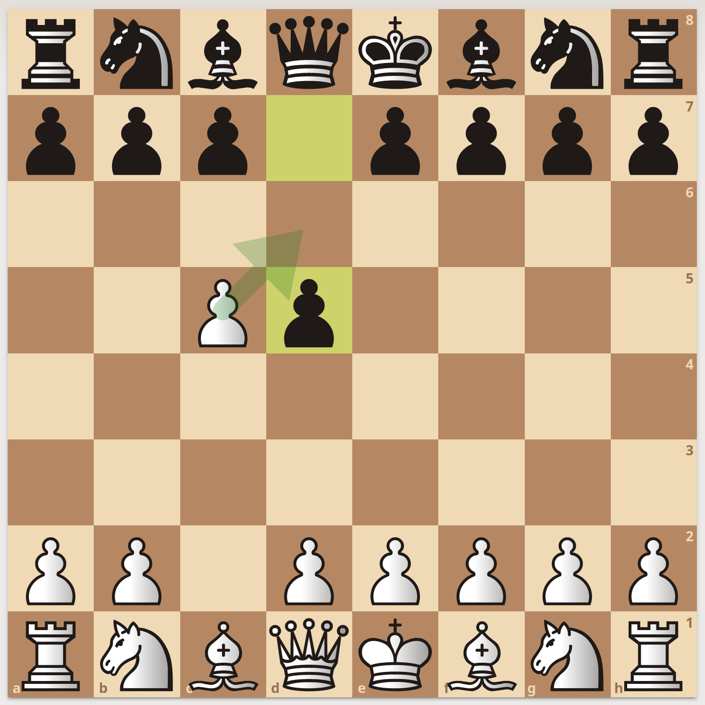

<!-- _class: lead -->

# Class Introduction

COLL 110, Spring 2023: Class 01

Clayton Ramsey

---

## Class outline

We'll be talking a lot about chess engines!

- Practical focus

- High-performance computing

- Just a little ML

---

## Grading

- quizzes (30%): ezpz points i promise

- projects (40%): basically just Rust hangout time

- attendance (10%): please do not flake on me (but you are also kind of allowed to)

- final project (20%): do what you want lol

you only need a 65% to get an S!!!

---

## Attendance

this basically exists so I won't be sad and alone once you all find other things to do on Thursday nights

- I will give an excused absence for any reason whatsoever

- I have decided that I will grant an award for the funniest reason for an excused absence request. award tbd

- the goal is to make you feel just a little guilty every time you skip my class

---

<!-- _class: lead -->

# Chess review

---

<!-- _class: lead -->

## En passant

